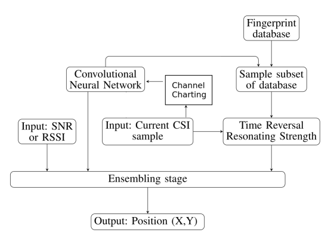

# Wireless Indoor Localization
## IEEE CTW 2019 – Positioning Algorithm Competition
Aim - Estimate position of a user in an indoor environment using channel state information obtained on antenna array.

[Problem Statement](http://attend.ieee.org/ctw-2019/wp-content/uploads/sites/105/2019/02/CTW2019_UserPos_Comp.pdf)

### Dataset Details
Channel responses were measured between a moving transmitter and an 8×2 antenna array. We have beeen provided with 14700 samples each containing
1. Channel response (16x924X2)
2. Position (1X3)
3. SNR (1X16)

The data are provided in three different formats (.mat, h5, and pickle), and available via the following links:

MAT: https://drive.google.com/open?id=1Ldk7Kz178Q7r6J7PwhIvVj_GIQUEoTls

H5: https://drive.google.com/open?id=1abRC-QsSBmWiyc6fFlL9x5mNO-9npSyc

PICKEL: https://drive.google.com/open?id=1hHahhemCgbTKaUiwQEDps989PAzbHH41

### Algorithms Tested

#### 1. Deep Convolutional Neural Network
A simple CNN was applied on available data to estimate position from Channel response. Implementation is available [here](CNN.ipynb).

#### 2. Polynomial Feature Extraction and Deep CNN
Polynomial fitting was applied on channel response to smoothen the output of each antenna. A CNN was trained to estimate position from the extracted features.  Implementation is available [here](polynomial_features.ipynb).

#### 3. Principal Component Analysis and Deep CNN
PCA was applied on channel response to smoothen the output of each antenna. A CNN was trained to estimate position from the extracted features. Implementation is available [here](PCA+CNN.ipynb).

#### 4. Convolutional Autoencoder and Deep CNN
A deep convolutional autoencoder was used for dimensionality reduction of input CSI. A CNN was trained for further estimation. Implementation is available [here](AE+CNN.ipynb).

#### Performance

| Algorithm         | Mean RMSE     | Median RMSE  |
| ------------------|:-------------:| :-----------:|
| Deep CNN          | 0.388         |0.264        |
| Poly Features+CNN | 0.18	        |0.123        |
| PCA+CNN           | 0.124         |0.0775       |
| Autoencoder+CNN   | 0.15          |0.1          |

### Ensembling with Time Reversal Resonating Strength

We selected the best deep learning based algorithm i.e PCA+CNN. From a fingerprint database of labelled data, for any given sample, we selected all the points inside a circle of radius 30 cm centred at its estimated position from PCA+CNN model. We applied TRRS on the fingerprint subset and estimated a position. Then we trained a simple fully connected neural network to make a high accuracy estimation by ensembling position extracted via PCA+CNN model, TRRS and also the available SNR Data.

Impelementation - [PCA_TRRS_Ensemble.ipynb](PCA_TRRS_Ensemble.ipynb)

#### Performance

| Algorithm         | Mean RMSE     | Median RMSE  |
| ------------------|:-------------:| :-----------:|
| PCA+CNN           | 0.124         |0.0775        |
| TRRS              | 0.061         |0.0363        |
| Ensemble          | 0.058         |0.0327        |

### Team
1. [Aayush Goyal](https://github.com/aayush2710)
2. [Kuntal Kokate](https://github.com/Kkuntal990)
3. [Krati Arela](https://github.com/krati012)

### Supervisor

Dr. Sai Dhiraj Amuru

Adjunct Assistant Professor, IIT Hyderabad

Hyderabad, India

E-mail: [asaidhiraj@iith.ac.in](mailto:asaidhiraj@iith.ac.in)

### References
1. Christoph Studer, Saeıd Medjkouh, Emre Gon ultas Tom Goldstein, andOlav Tirkkonen- Channel Charting: Locating Users within the Radio Environment using Channel State Information

2. Abdallah Sobehy, Eric Renault, Paul Muhlethaler- NDR: Noise and Dimensionality Reduction of CSI for indoor positioning using deep learning

3. Simon Tewes, Alaa Alameer Ahmad, Jaber Kakar, Udaya MiriyaThanthrige, Stefan Roth, Aydin Sezgin- Ensemble-based Learning in Indoor Localization: A Hybrid Approach

4. M. Arnold, J. Hoydis and S. T. Brink- Novel Massive MIMO Channel Sounding Data applied to DeepLearning-based Indoor Positioning. In SCC 2019; 12th International ITG Conference on Systems, Communications and Coding, pp. 1-6. VDE, 2019
